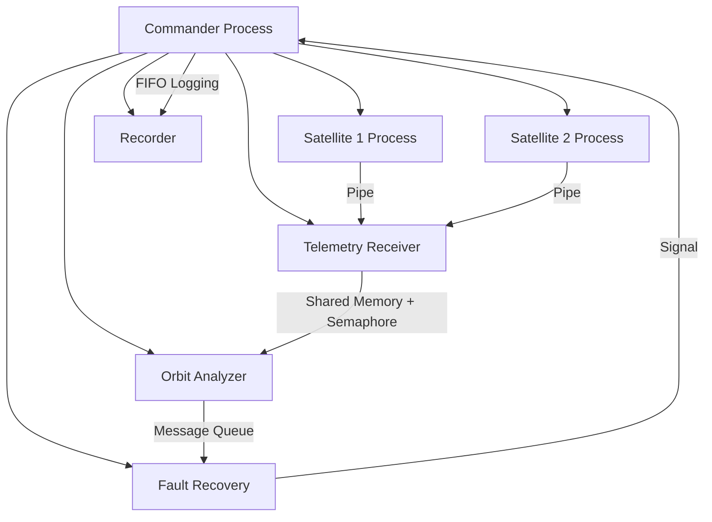

# Space Mission Telemetry Monitoring System

## Project Overview

This project simulates a **Space Mission Telemetry Monitoring System** using Linux system calls and POSIX APIs.
The system models how satellites send telemetry data to a ground station where the data is analyzed for anomalies and recovery actions are triggered.

The project demonstrates practical usage of **Linux IPC mechanisms, process control, multithreading, signal handling, and file operations**.

This project was developed as part of the **Linux System Calls & IPC Mini Project**.

---

## Scenario Description

In a real space mission, satellites continuously send telemetry data such as temperature, battery status, and position to a ground control system.

This project simulates that system using:

* Multiple processes
* Multi-threaded telemetry generation
* Inter-process communication
* Signal-based alerts
* File-based logging

---

## System Architecture



The system consists of multiple processes communicating using different IPC mechanisms.

Satellite processes generate telemetry data such as:

* Temperature
* Battery Level
* Position Coordinates

This data is transmitted to a telemetry receiver which stores the information in shared memory.
An analyzer checks the telemetry data for anomalies such as low battery levels and sends alerts to a recovery system.

---

## Key Features

* Multi-process architecture using `fork()` and `exec()`
* Multi-threaded satellite telemetry generation using `pthreads`
* Multiple IPC mechanisms
* Signal-based anomaly notification
* Logging system using file operations
* Simulated telemetry using random data

---

## Technologies Used

### Language

* C

### Operating System APIs

* POSIX APIs
* Linux System Calls

---

## System Calls Used

### File Operations

* `open()`
* `read()`
* `write()`
* `close()`

Used for creating and updating mission log files.

---

### Process Management

* `fork()`
* `exec()`
* `waitpid()`

Used to create and manage multiple processes in the system.

---

### Threads and Synchronization

* `pthread_create()`
* `pthread_join()`
* `pthread_mutex_lock()`
* `pthread_mutex_unlock()`

Used for generating telemetry data concurrently within satellite processes.

---

### Signals

* `sigaction()`
* `kill()`

Signals are used to notify the commander process when anomalies are detected.

---

## IPC Mechanisms Used

This project demonstrates several Inter-Process Communication mechanisms.

### Pipe

Used for communication between:

Satellite → Telemetry Receiver

---

### Shared Memory

Used to store telemetry data that can be accessed by multiple processes.

---

### Semaphore

Used to synchronize access to shared memory and prevent race conditions.

---

### Message Queue

Used to send alert messages from the analyzer process to the recovery system.

---

### FIFO (Named Pipe)

Used by the recorder process to store mission logs in a file.

---

## Project Structure

```
space_mission/

├── commander.c
├── satellite.c
├── telemetry.c
├── orbit_analyzer.c
├── fault_recovery.c
├── recorder.c
├── common.h
├── Makefile
└── README.md
```

---

## Build Instructions

Compile the project using:

```
make
```

---

## Run the Simulation

Run the mission commander:

```
make run
```

---

## Sample Output

Example telemetry output:

Satellite 1 → Temp:59 Battery:100 Position:(3,1)
Satellite 2 → Temp:59 Battery:100 Position:(3,1)

If battery level drops below threshold:

Recovery: Battery low in Satellite 1
Recovery: Battery low in Satellite 2
Anomaly detected!

---

## Logging

Mission events are recorded in the file:

```
mission_log.txt
```

---

## Clean Shutdown

Press **CTRL + C** to stop the simulation.

The commander process terminates all child processes and cleans IPC resources to avoid zombie processes.

---

## Learning Outcomes

Through this project the following Linux concepts were implemented:

* Process creation and management
* Multithreading using POSIX threads
* Interprocess communication
* Synchronization using semaphores and mutexes
* Signal handling
* File I/O operations

---

## Author

Prajakta Dhole
Linux System Programming Mini Project
